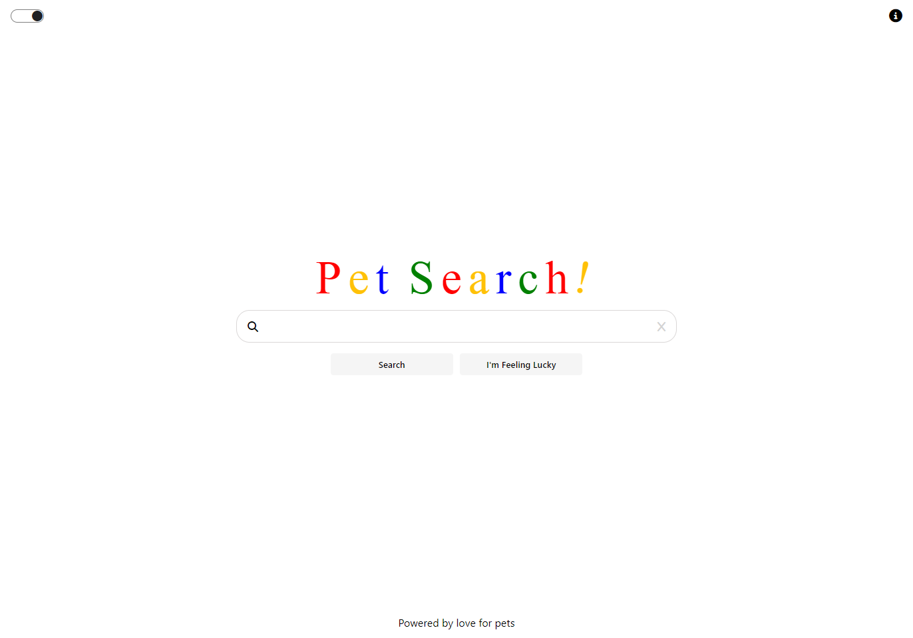

# Pet Search Engine

Welcome to our Pet Search Engine!
Search for the different types of pets and get back results which match your search.

## Installation & Usage

### Installation

- Clone or download the repo.
- Open terminal and navigate to the backend folder
- Run `npm install` to install the dependencies

### Usage

- Open terminal and navigate to backend folder
- Run `npm run dev` to ensure the server is up and running
- Navigate to frontend folder and then and open the `index.html` with a live server

## Technologies

- JavaScript
- Express
- Node.js
- Jest

## Screenshots/Images

### Homepage

### Search Results

## Bugs

- When user Clicks on the random link button the api runs before redirecting to the page

## Wins & Challenges

### Wins

- Developed our knowledge of how to fetch data
- Learned how to remove dom elements using JavaScript

### Challenges

- Had issues integrating css and scss which set us back

## Future Features

- Frontend deployed on Firebase
- Backend deployed on Heroku
- Use Google API
